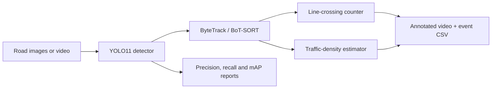

# YOLO Road-Safety Traffic Monitor

An end-to-end computer-vision project that detects, tracks, and counts road users and vehicles, then estimates traffic density from images, videos, or a webcam.

## Capabilities

- Detect six classes: person, bicycle, car, motorcycle, bus, and truck
- Fine-tune YOLO11 on a custom YOLO-format dataset
- Compare YOLO11n, YOLO11s, and YOLO11m under the same experiment settings
- Report overall and per-class precision, recall, mAP@50, and mAP@50–95
- Track objects with ByteTrack or BoT-SORT
- Count class-wise crossings in both directions across a configurable line
- Estimate low, moderate, or high traffic density using visible frame occupancy
- Save annotated videos and a CSV event log
- Run an interactive Streamlit image/video demo

No ONNX export is included in this project.

## System flow



## Quick start

```bash
python -m venv .venv
source .venv/bin/activate              # Windows: .venv\\Scripts\\activate
pip install -r requirements.txt
python src/prepare_dataset.py
```

The included COCO128-derived dataset is only a smoke-test dataset. See [data/README.md](data/README.md) before claiming model quality.

## Train and evaluate

```bash
python src/train.py --data data/dataset.yaml --model yolo11s.pt --epochs 100 --imgsz 640 --batch 16 --name road_safety_yolo11s
python src/validate.py --model runs/detect/road_safety_yolo11s/weights/best.pt --data data/dataset.yaml
```

Evaluation writes:

- `runs/evaluation/summary.json`
- `runs/evaluation/per_class_metrics.csv`
- Ultralytics confusion matrices and precision/recall plots

## Compare YOLO model sizes

```bash
python src/compare_models.py \
  --models yolo11n.pt yolo11s.pt yolo11m.pt \
  --data data/dataset.yaml \
  --epochs 50 \
  --device 0
```

The comparison CSV records model parameters, checkpoint size, precision, recall, both mAP measures, and inference latency.

## Monitor traffic video

```bash
python src/traffic_monitor.py \
  --model runs/detect/compare_yolo11m/weights/best.pt \
  --source traffic.mp4 \
  --output runs/traffic_monitor/annotated.mp4 \
  --device 0
```

Use `--line-position 0.6` to move the counting line, `--tracker botsort.yaml` to change trackers, and `--source 0` for a webcam.

## Interactive demo

```bash
streamlit run app.py
```

Upload an image for detection or a video for tracking, bidirectional counting, traffic-density measurement, annotated-video download, and CSV event export.

## Google Colab

Follow [COLAB.md](COLAB.md) for GPU training, model comparison, video monitoring, and saving outputs permanently to Google Drive.

## Current results

| Experiment | Precision | Recall | mAP@50 | mAP@50–95 |
| --- | ---: | ---: | ---: | ---: |
| YOLO11n, 3-epoch smoke test | 0.0048 | 0.1219 | 0.0474 | 0.0313 |
| YOLO11s, T4 validation | 0.744 | 0.161 | 0.202 | 0.139 |
| YOLO11m, T4 validation | **0.836** | **0.181** | **0.335** | **0.224** |

YOLO11m produced the strongest validation result in the Colab comparison. On a 300-frame real-traffic demonstration clip, the monitoring pipeline maintained 44 unique car tracks and 6 unique person tracks, while recording average/peak frame occupancy of 3.42%/7.99%. This is pipeline evidence rather than a deployment benchmark because the training dataset is small and imbalanced.

Reproducible tables, plots, and the complete demo summary are in [results/](results/).

## Project structure

```text
├── app.py                      # Streamlit interface
├── src/
│   ├── prepare_dataset.py      # Reproducible demo-data preparation
│   ├── dataset_report.py       # Dataset balance report
│   ├── train.py                # Fine-tuning
│   ├── validate.py             # Overall and per-class evaluation
│   ├── compare_models.py       # Fair model-size comparison
│   ├── predict.py              # Standard inference
│   └── traffic_monitor.py      # Tracking, counting and density engine
├── data/                       # Dataset configuration and guide
├── results/                    # Curated experiment evidence
└── tests/                      # Monitoring-logic tests
```

## Limitations

- COCO128 is too small and imbalanced for a reliable safety system.
- Occupancy is a camera-view proxy for traffic density, not physical road occupancy.
- Line crossing depends on stable tracking and an appropriate camera angle.
- The system must be validated on footage from its intended deployment environment.

## License

Project code is available under the MIT License. Review the Ultralytics licensing terms before commercial use.
