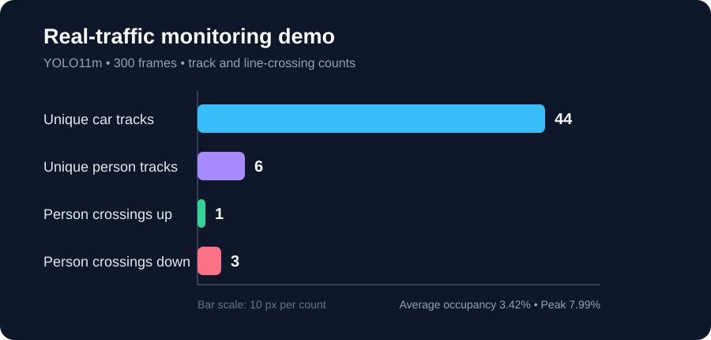
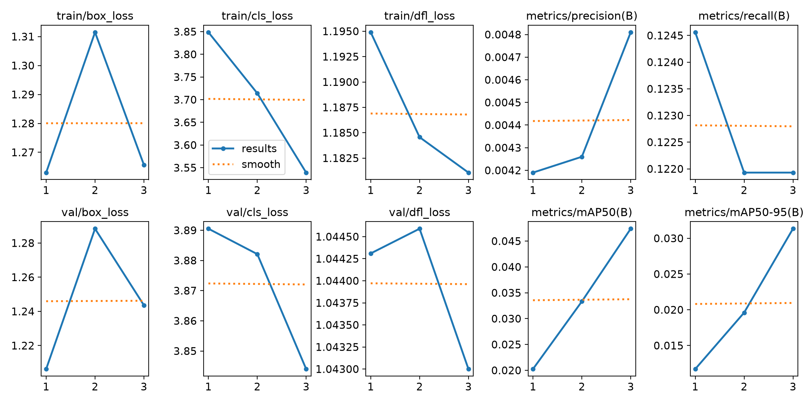
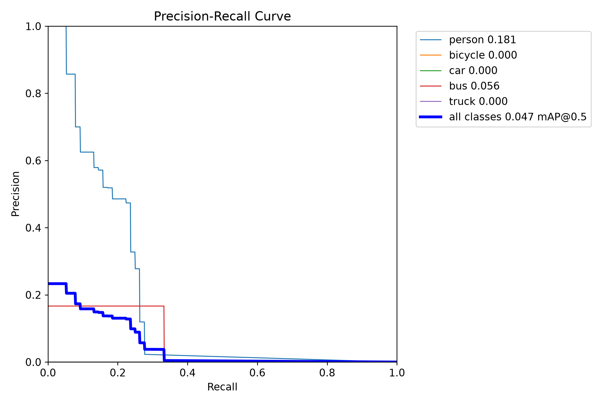
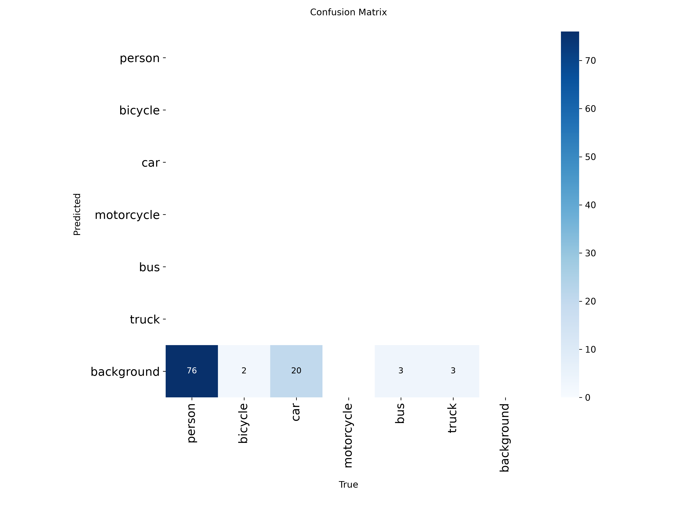
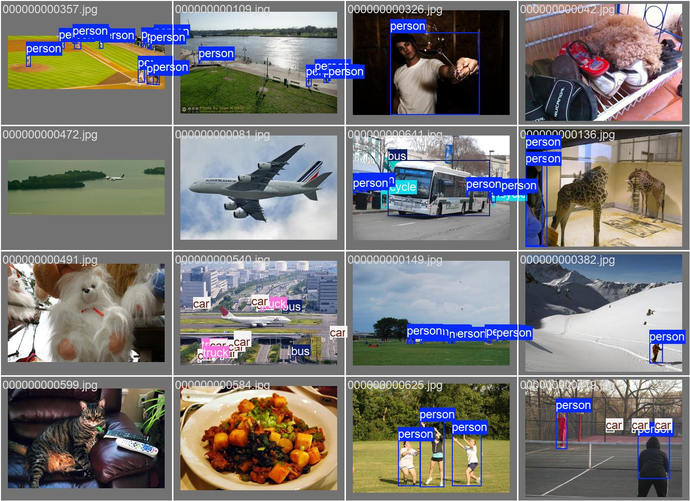

# Experiment results

## Experiment setup

| Setting | Value |
| --- | --- |
| Model | YOLO11n (pretrained) |
| Dataset | Filtered COCO128 road-safety subset |
| Classes | person, bicycle, car, motorcycle, bus, truck |
| Train / validation images | 102 / 26 |
| Image size | 320 × 320 |
| Epochs | 3 |
| Hardware | Apple M2 (MPS) |

## Metrics by epoch

| Epoch | Precision | Recall | mAP@50 | mAP@50–95 | Train box loss | Train class loss |
| ---: | ---: | ---: | ---: | ---: | ---: | ---: |
| 1 | 0.0042 | 0.1246 | 0.0203 | 0.0117 | 1.2630 | 3.8487 |
| 2 | 0.0043 | 0.1219 | 0.0333 | 0.0196 | 1.3115 | 3.7141 |
| 3 | 0.0048 | 0.1219 | 0.0474 | 0.0313 | 1.2657 | 3.5392 |

This is a smoke-test baseline using a small, automatically filtered sample and only three epochs. It demonstrates that the full data-to-inference pipeline runs; it is not suitable for safety-critical deployment. A stronger result needs a larger purpose-labelled dataset and substantially longer training.

## T4 Colab validation

| Model | Precision | Recall | mAP@50 | mAP@50–95 | Inference |
| --- | ---: | ---: | ---: | ---: | ---: |
| YOLO11s | 0.744 | 0.161 | 0.202 | 0.139 | 16.4 ms/image |
| YOLO11m | **0.836** | **0.181** | **0.335** | **0.224** | 26.0 ms/image |

YOLO11m was selected for the video demonstration because it achieved the strongest validation accuracy. These numbers are still constrained by the 128-image COCO128-derived split and should not be interpreted as production performance. Machine-readable metrics are in [`colab_validation_metrics.csv`](colab_validation_metrics.csv).

## Real-traffic monitoring demonstration

The selected YOLO11m checkpoint was run on a 300-frame public traffic-scenario clip. The end-to-end pipeline generated an annotated MP4 and a frame-level CSV event log.

| Metric | Result |
| --- | ---: |
| Frames processed | 300 |
| Unique car tracks | 44 |
| Unique person tracks | 6 |
| Person crossings up | 1 |
| Person crossings down | 3 |
| Average frame occupancy | 3.42% |
| Peak frame occupancy | 7.99% |

The source data are available in [`traffic_demo_summary.csv`](traffic_demo_summary.csv). Track counts show IDs maintained by the tracker, not ground-truth object counts; occupancy is the fraction of image area covered by detections.

## Visual artifacts

| Training curves | Precision / recall | Confusion matrix |
| --- | --- | --- |
|  |  |  |

| Validation labels | Validation predictions |
| --- | --- |
|  |  |
